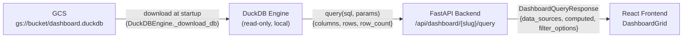
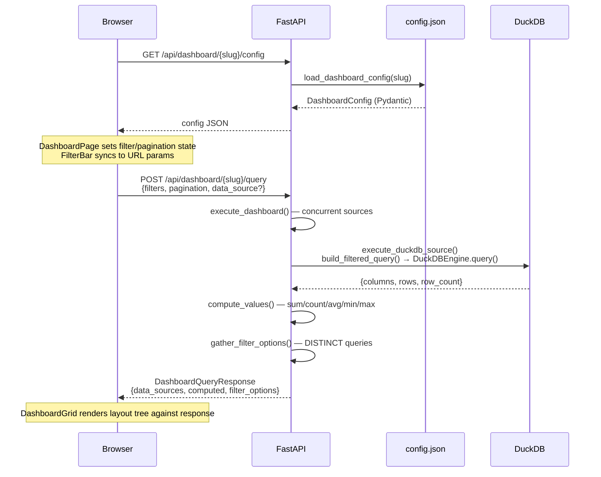
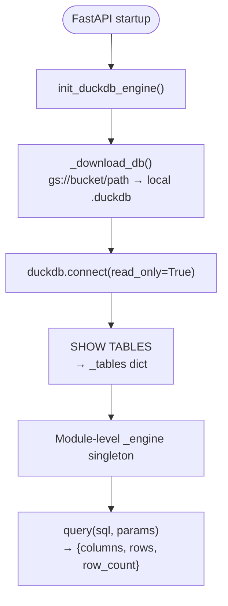
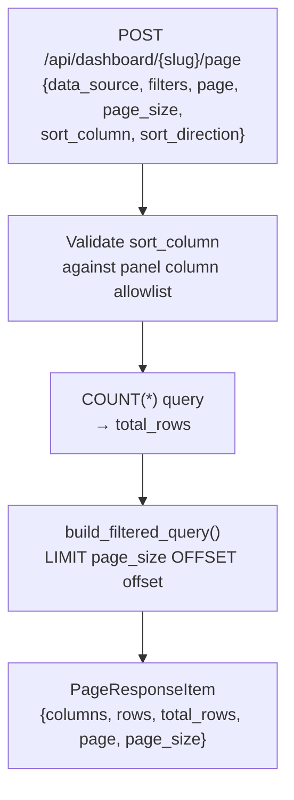
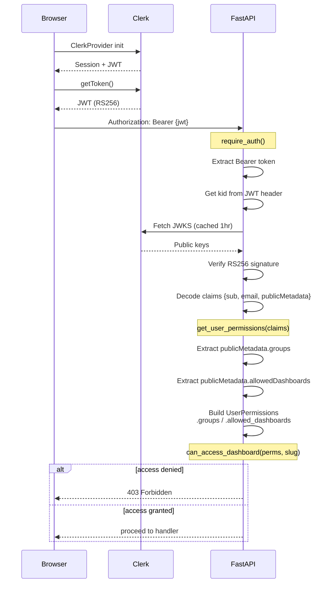
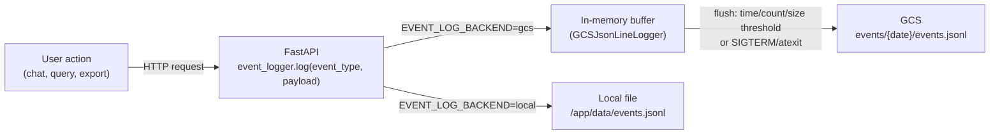
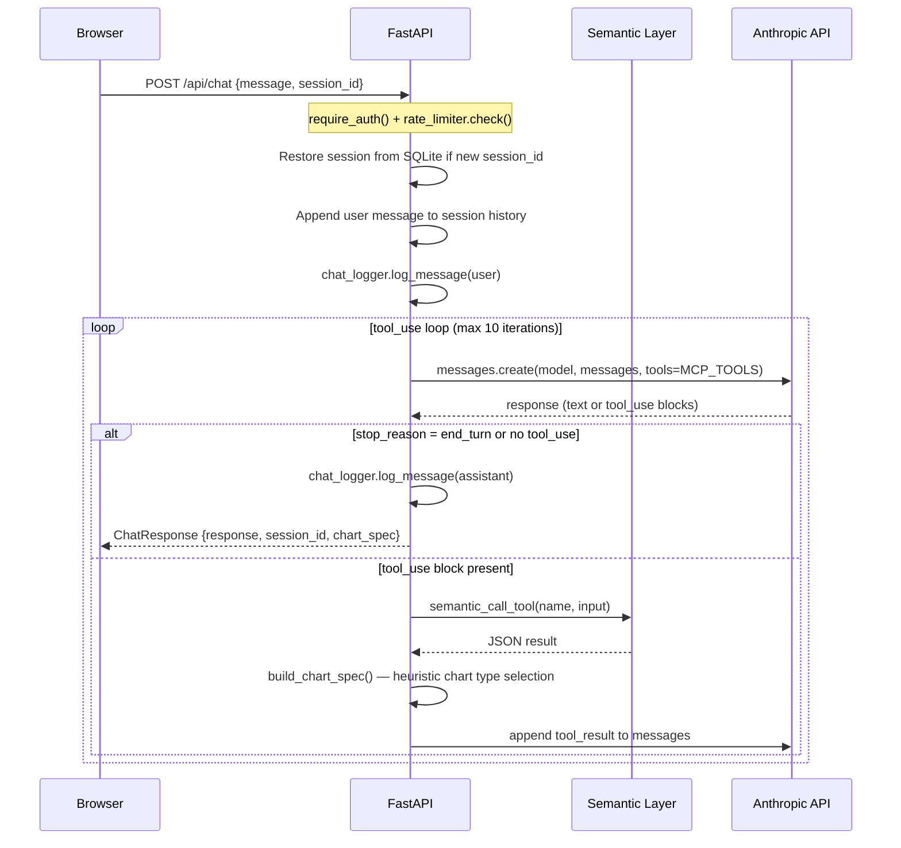

# Frontend Architecture

Reference for the Tanit data ops frontend. Config-driven dashboards backed by DuckDB, authenticated via Clerk.

## Module Map

```
project/tanit/
  backend/                  FastAPI application (Python)
    app.py                  Route definitions, middleware stack, startup
    auth.py                 Clerk JWT verification (JWKS fetch + cache)
    permissions.py          Config-driven RBAC from permissions.json
    config.py               Env var loading, path resolution, startup validation
    dashboard.py            Config loading, validation, query orchestration
    dashboard_query.py      SQL parameterization, filter binding, DuckDB/semantic execution
    dashboard_models.py     Pydantic models (config schema, API request/response)
    duckdb_engine.py        DuckDB OLAP engine (GCS download, read-only queries)
    semantic.py             Semantic layer MCP tool bridge
    chat_logger.py          SQLite chat persistence
    usage_logger.py         SQLite usage tracking + middleware
    rate_limiter.py         Per-user rate limiting
    prompts/system.md       Chat system prompt

  frontend/src/             React SPA (TypeScript, Vite)
    App.tsx                 Router, Clerk auth gates, top-level layout
    theme.ts                Chakra UI v3 theme tokens
    api/
      dashboard.ts          fetchDashboardConfig(), queryDashboard()
      exportDashboard.ts    downloadCsv(), downloadXlsx()
    views/
      DashboardPage.tsx     Single dashboard: config fetch, query, filter/page state
      DashboardIndex.tsx    Dashboard listing (from /api/dashboards)
      ChatView.tsx          AI chat interface
      MetricTreeView.tsx    Metric tree explorer
      ProcessMapView.tsx    Process map visualization
    components/
      Dashboard/
        DashboardGrid.tsx   Recursive layout renderer (section/row/panel dispatch)
        PanelWrapper.tsx    Card chrome: loading skeleton, error state, retry
        PageTabs.tsx        Multi-page tab navigation
        filters/            FilterBar, DateRangeFilter, MultiselectFilter, TextFilter
        panels/             BigValuePanel, TablePanel, LinePanel, BarPanel, AreaPanel, PiePanel
      Auth/
        ProtectedRoute.tsx  Route guard
      Layout/
        TopNav.tsx          App header
    hooks/
      useFilterState.ts     URL <-> filter state sync (searchParams)
    types/
      dashboard.ts          TypeScript interfaces mirroring Pydantic models

project/dashboard-content/
  dashboards/{slug}/        One directory per dashboard
    config.json             Dashboard definition (schema_version 1)
    *.sql                   DuckDB SQL files referenced by config
  semantic-layer/           Metric definitions for chat system prompt
  data/                     Static data files (mounted at /data)
  permissions.json          User/group -> dashboard access mapping
```

## Key Abstractions

### Config Schema (DashboardConfig)

The central abstraction. A single JSON file defines everything a dashboard needs.

```
DashboardConfig
  schema_version: 1
  title, description
  data_sources:     {name -> DuckDBSource | SemanticSource}
  filters:          {name -> FilterDef}
  computed:         {name -> ComputedValue}
  layout:           LayoutNode[]          (flat or single-page)
  pages:            PageDef[]             (multi-page, each with own layout)
```

### Data Sources

Two source types:

```
DuckDBSource                        SemanticSource
  source: "duckdb"                    source: "semantic"
  sql_ref: "detail.sql"              model: "model_name"
  table_name: "..."                   dimensions, measures
  filters: ["@date:col"]             time_grain
  text_filters: ["@search:col"]      filters: ["@date:col"]
  pagination: {page_size, server_side}
  cache_ttl_seconds
```

### Layout Tree (LayoutNode)

Discriminated union on `type`. Recursive via children.

```
LayoutNode = section | row | big_value | table | chart

section   -- title + children[]
row       -- children[] (12-col grid row)
big_value -- value ref ($computed.X), format
table     -- data_source, columns[], default_sort, pagination, aggregations
chart     -- data_source, chart_type (line|bar|area|pie), x, y, series
```

Width is in grid columns (out of 12). Defaults: big_value=3, table=12, chart=12.

### Panel Components

```
DashboardGrid
  renderNode(LayoutNode) -- switch on type:
    section  -> Heading + recursive children
    row      -> Grid + recursive children
    big_value -> BigValuePanel (resolves $computed refs)
    table    -> PanelWrapper > TablePanel (sort, paginate, export)
    chart    -> PanelWrapper > LinePanel | BarPanel | AreaPanel | PiePanel
```

PanelWrapper provides the card chrome: loading skeleton, error badge with retry, header actions (export buttons).

## Data Flow

### Inbound Data: GCS to Frontend



### Dashboard Rendering



### DuckDB Engine Lifecycle



The DuckDB file is pre-built by upstream pipelines and stored in GCS. The backend downloads it once at startup. All dashboard queries run against this local read-only file.

### Filter Binding

Filters connect config-level filter IDs to SQL columns via binding strings:

```
Config:   "filters": ["@date_range:consultation_status_finalized_at"]
                       ^filter_id  ^column_name

Result:   WHERE consultation_status_finalized_at >= $p_date_range_start
          AND consultation_status_finalized_at < $p_date_range_end + INTERVAL '1 day'
```

Filter types and their SQL generation:
- `date_range` -> `>= $start AND < $end + 1 day`
- `multiselect` -> `IN (SELECT UNNEST($values))`
- `text` (exact) -> `= $value`
- `text` (contains) -> `LOWER(col) LIKE CONCAT('%', LOWER($value), '%')`

### Server-Side Pagination



Page size capped at 500. Offset capped at 50,000 rows.

## Auth Flow



Two token extraction paths:
- `require_auth` -- reads `Authorization: Bearer` header (API calls)
- `verify_session_cookie` -- reads `__session` cookie (static file serving)

JWKS keys are cached for 1 hour. On key rotation miss, cache is force-refreshed once.

## Outbound Data: Event Logging

User interactions are written out as structured JSONL. The backend (GCS or local) is selected via `EVENT_LOG_BACKEND`.



## Chat Flow



## API Surface

```
Auth-protected (require_auth dependency on all):

GET  /api/health                           Health check (anthropic, content, duckdb, dbs)
GET  /api/dashboards                       List accessible dashboards
GET  /api/permissions                      Current user's groups + dashboard access
GET  /api/dashboard/{slug}/config          Dashboard config (no SQL content)
POST /api/dashboard/{slug}/query           Execute dashboard queries
POST /api/dashboard/{slug}/page            Paginate single data source
POST /api/dashboard/{slug}/export/{id}/csv   Stream CSV export
POST /api/dashboard/{slug}/export/{id}/xlsx  Excel export
POST /api/chat                             Claude chat with semantic layer tools
POST /api/semantic/query                   Direct semantic layer query
```

## Middleware Stack (order matters)

```
SecurityHeadersMiddleware    CSP, HSTS, X-Frame-Options, etc.
RequestIDMiddleware          UUID per request, structlog context binding
UsageLoggingMiddleware       SQLite usage tracking
CORSMiddleware               Allow origins from ALLOWED_ORIGINS env
```

## Frontend Routing

```
/                     ChatView (AI chat)
/metric-tree          MetricTreeView
/process-map          ProcessMapView
/dashboards           DashboardIndex (card grid)
/dashboards/:slug     DashboardPage (config-driven)
/not-authorized       NotAuthorized
```

All routes wrapped in `ProtectedRoute` (requires Clerk `SignedIn`). Unauthenticated users see Clerk `SignIn` widget.

## Config Validation

Runs at startup via `validate_all_dashboards()`. Checks:

1. Panel `data_source` references exist in `data_sources`
2. Filter bindings reference existing filters
3. Computed `source` references exist
4. `options_from.data_source` references exist
5. `sql_ref` files exist on disk
6. No path traversal in `sql_ref`
7. Filter `depends_on` forms a DAG (no cycles)
8. Chart guardrails (pie >6 slices, line >7 series, stacked bar >4 series)

## Environment Variables

```
CONTENT_ROOT              Path to dashboard-content directory
ENVIRONMENT               local | staging | production
CLERK_PUBLISHABLE_KEY     Clerk auth (required)
DUCKDB_GCS_URL            gs://bucket/path/dashboard.duckdb (required)
DUCKDB_GCS_CREDENTIALS    Path to GCS service account JSON
DUCKDB_LOCAL_PATH         Local download target for .duckdb file
PERMISSIONS_CONFIG        Path to permissions.json
ANTHROPIC_API_KEY         Claude API key for chat
ALLOWED_ORIGINS           Comma-separated CORS origins
LOG_LEVEL                 INFO | DEBUG | WARNING | ERROR
LOG_FORMAT                text | json
LOG_FILE_PATH             Optional file output for structured logs
```

## User Decision Points

Every place an operator or developer must make a configuration choice.

---

### Clerk Dashboard

**What it controls:** User accounts, group membership, MFA enforcement, and JWT claims embedded in every auth token.

**Where to find it:** https://dashboard.clerk.com — sign in with the org account.

**How to change it:**

- Add/remove users: Users -> Invite or delete.
- Assign groups: Edit a user's Public Metadata field. Set `groups` to a JSON array, e.g. `{"groups": ["analytics"]}`. Group names must match keys in `permissions.json`.
- Grant direct dashboard access: Add `allowedDashboards` to Public Metadata, e.g. `{"allowedDashboards": ["consultations", "payment-audit"]}`. Use `["*"]` for unrestricted access.
- Grant route access: Add `allowedRoutes` to Public Metadata, e.g. `{"allowedRoutes": ["/metric-tree"]}`.
- Enable MFA: Settings -> User & Authentication -> Multi-factor. Enforce per-org or per-user.
- Rotate signing keys: Settings -> API Keys. The backend auto-refreshes JWKS within 1 hour, or immediately on a key-miss.

---

### permissions.json

**What it controls:** Group-to-dashboard mappings, per-user group overrides, and the dashboard registry (title, description, path shown in the listing UI).

**Where to find it:** `project/dashboard-content/permissions.json`. Mounted into the container at `CONTENT_ROOT/permissions.json`. Override the path via the `PERMISSIONS_CONFIG` env var.

**Schema:**

```json
{
  "groups": {
    "<group-name>": ["<slug>", ...] | ["*"]
  },
  "users": {
    "<email>": {
      "groups": ["<group-name>"],
      "extra_dashboards": ["<slug>"]
    }
  },
  "dashboards": {
    "<slug>": {
      "title": "...",
      "description": "...",
      "path": "/dashboards/<slug>"
    }
  }
}
```

**How to change it:**

- Add a group: add a key under `groups` with a list of dashboard slugs, or `["*"]` for all.
- Register a new dashboard: add an entry under `dashboards` whose key matches the slug directory name under `dashboards/`.
- Grant a user extra access without changing their Clerk metadata: add them under `users` with `extra_dashboards`.

`permissions.json` is loaded at backend startup. Restart the container after editing.

---

### Dashboard config.json Files

**What they control:** Everything about a single dashboard — title, data sources, SQL references, filters, computed values, layout, panels, chart types, pagination, and multi-page structure.

**Where to find them:** `project/dashboard-content/dashboards/{slug}/config.json`. One directory per dashboard. SQL files referenced by `sql_ref` live alongside `config.json` in the same directory.

**How to change them:**

- Add a dashboard: create `dashboards/<slug>/` with a `config.json` (schema_version 1) and register the slug in `permissions.json` under `dashboards`.
- Add a panel: add a `LayoutNode` entry (`big_value`, `table`, or `chart`) inside `layout` or a page's `layout`. Point it at a named entry in `data_sources`.
- Change a query: edit the `.sql` file referenced by `sql_ref` in the relevant `DuckDBSource`.
- Add a filter: define it in `filters`, then add a binding string to the relevant `data_source.filters` list (e.g. `"@date_range:column_name"`).
- Add a page: replace top-level `layout` with a `pages` array, each entry with a `title` and `layout` array.
- Adjust cache: set `cache_ttl_seconds` on a `DuckDBSource` to control how long query results are cached.

Config is validated on backend startup (`validate_all_dashboards()`). Startup fails (or warns in local/dev) if SQL files are missing, filter references are broken, or chart guardrails are violated.

---

### Environment Variables

**What they control:** Runtime wiring — where content lives, which GCS bucket to pull DuckDB from, auth keys, logging behavior.

**Where to find them:** Cloud Run service configuration (Console -> Cloud Run -> service -> Edit & Deploy -> Variables & Secrets), or a local `.env` file for development.

| Variable | Required | Default | What it controls |
|---|---|---|---|
| `CONTENT_ROOT` | No | `/app/content` | Root directory for `dashboards/` and `permissions.json` |
| `ENVIRONMENT` | No | `local` | `local`/`dev` makes startup config errors non-fatal |
| `CLERK_PUBLISHABLE_KEY` | Yes | — | Clerk frontend key; used to construct the JWKS URL for JWT verification |
| `DUCKDB_GCS_URL` | Yes | — | Full GCS path to the DuckDB file, e.g. `gs://bucket/path/dashboard.duckdb` |
| `DUCKDB_GCS_CREDENTIALS` | No | `/app/secrets/gcs-credentials.json` | Path to GCS service account JSON for downloading the DuckDB file |
| `DUCKDB_LOCAL_PATH` | No | `/app/data/dashboard.duckdb` | Local path where the DuckDB file is written at startup |
| `PERMISSIONS_CONFIG` | No | `$CONTENT_ROOT/permissions.json` | Override path to permissions.json |
| `ANTHROPIC_API_KEY` | No | — | Claude API key; required for the chat endpoint |
| `ALLOWED_ORIGINS` | No | — | Comma-separated CORS origins, e.g. `https://app.example.com` |
| `LOG_LEVEL` | No | `INFO` | `INFO`, `DEBUG`, `WARNING`, or `ERROR` |
| `LOG_FORMAT` | No | `text` | `text` for human-readable, `json` for structured log ingestion |
| `LOG_FILE_PATH` | No | — | If set, logs are also written to this rotating file (10 MB, 3 backups) |

**How to change them:** In Cloud Run, update the service revision. Changes take effect on the next deploy/restart. For local dev, edit your `.env` file and restart `uvicorn`.

---

### GCS Bucket Locations

**What they control:** Where the pre-built DuckDB analytical database is stored. The backend downloads this file once at startup and runs all dashboard queries against it locally.

**Where to find them:** The full GCS path is in the `DUCKDB_GCS_URL` environment variable. The bucket and object path are determined when the upstream pipeline writes the file.

**How to change them:**

- To point to a different file or bucket: update `DUCKDB_GCS_URL` in the Cloud Run service environment and redeploy.
- To refresh the data: re-run the upstream pipeline that writes the `.duckdb` file to GCS, then restart the backend container so it downloads the new version.
- The service account in `DUCKDB_GCS_CREDENTIALS` must have `storage.objects.get` on the target bucket.

---

### DuckDB Data Paths

**What they control:** Where the DuckDB file lands locally inside the container, and which tables are available for SQL queries in dashboard configs.

**Where to find them:** `DUCKDB_LOCAL_PATH` (default `/app/data/dashboard.duckdb`). The engine discovers available tables at startup via `SHOW TABLES`.

**How to change them:**

- To change the local download path: set `DUCKDB_LOCAL_PATH` to a path inside a writable directory. The parent directory must exist and be writable at startup.
- To add or rename tables: modify the upstream pipeline that builds the DuckDB file. After a rebuild and backend restart, the new table names are available for use in `sql_ref` SQL files.
- Tables not present in the DuckDB file cannot be queried. Referencing a missing table produces a runtime error when the dashboard is queried.
